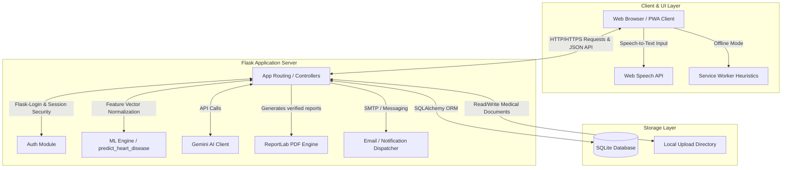
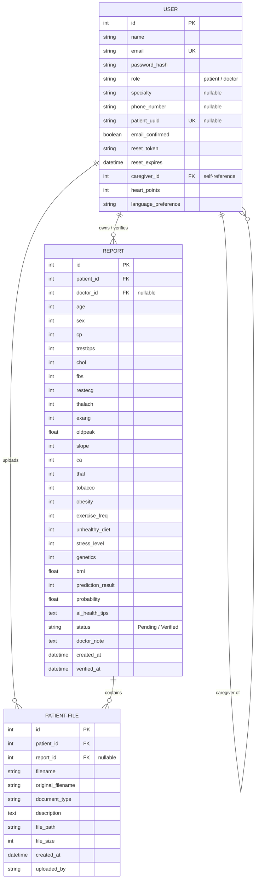
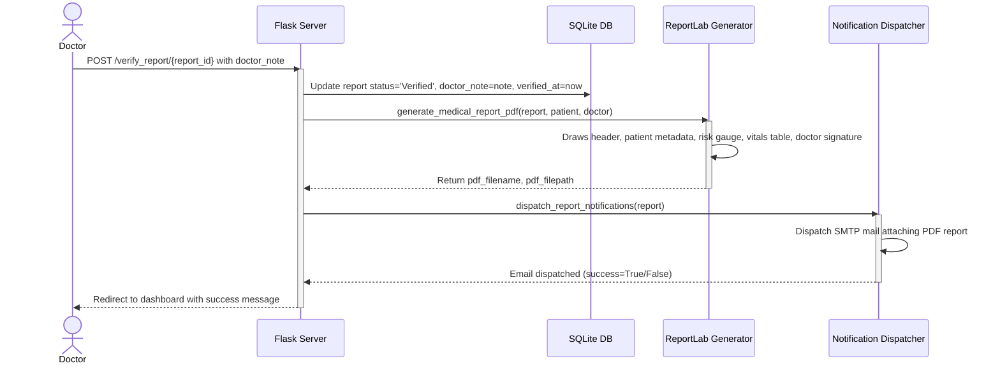

# HeartGuard AI — Technical Specification & Architecture Document
## Intelligent Cardiac Risk Assessment System (v4.0)

This document provides a comprehensive technical overview of **HeartGuard AI v4.0**, detailing the architecture, database schema, machine learning ensemble model, API specification, and core workflows.

---

## 🏗️ 1. System Architecture Overview

HeartGuard AI is designed as a secure, scalable web application running on a unified Python Flask backend, SQLite database layer, scikit-learn machine learning pipeline, and Google Gemini AI model. The system is compliant with the **National Digital Health Mission (NDHM)** for health data portability, patient consent management, and granular user roles.

### 🔌 Tech Stack
- **Backend Framework:** Flask 2.x (Python 3.8+)
- **Database Layer:** SQLite3 with SQLAlchemy ORM
- **Machine Learning Core:** Scikit-learn, joblib, pandas, numpy
- **Generative AI Core:** Google Gemini 2.5 Flash API
- **Document Generation:** ReportLab PDF Engine
- **Authentication:** Flask-Login + PBKDF2 Password Hashing
- **Frontend Architecture:** HTML5, CSS3, Tailwind CSS (via CDN), Vanilla JavaScript
- **PWA Capabilities:** Service Worker API for offline assessment heuristics

### 📁 Directory Layout
```
heartguard_new/
├── backend/
│   ├── app.py                 # Flask server routes & application setup
│   ├── models.py              # SQLAlchemy database declarations
│   ├── ml_core.py             # Machine learning ensemble & inference engine
│   ├── gemini_integration.py  # Google Gemini AI configuration & chatbot API
│   ├── notifications.py       # Notifications dispatch layer (Email & WhatsApp stub)
│   └── pdf_generator.py       # ReportLab medical PDF report generator
├── frontend/
│   ├── templates/             # Jinja2 HTML templates
│   └── static/
│       ├── css/style.css      # Core styles & custom variables
│       ├── js/main.js         # Frontend interactive logic
│       ├── js/service-worker.js # Progressive Web App offline worker
│       ├── qrcodes/           # Generated Patient QR code images
│       └── reports/           # Generated PDF report downloads
├── datasets/                  # ML training clinical CSV files (1,302 records)
├── instance/                  # SQLite DB & uploaded patient records (PDF, PNG)
└── model.pkl                 # Serialized model ensemble file (joblib format)
```

### 🔁 High-Level Architecture Diagram


---

## 🧠 2. Machine Learning Pipeline & Ensemble Model

The heart disease prediction model utilizes a **6-model soft-voting ensemble** trained on five distinct datasets containing a combined 1,302+ clinical records.

### 📋 Training Datasets Integrated
1. `heart.csv` — Standard UCI Heart Disease dataset
2. `heart_dataset_bharath0609_304.csv` (304 records)
3. `heart_dataset_jocelyndumlao_1000.csv` (1,000 records)
4. `heart_dataset_RafaelGranza_1026.csv` (1,026 records)
5. `heart_dataset_rishidamarla_271.csv` (271 records)http://127.0.0.1:5000

### ⚙️ Individual Model Configurations & Accuracies
Each model is fitted using a standard scaler calculated from the concatenated training data. Cross-validation (CV) scores are obtained via 5-fold cross-validation.

| Classifier | Model Class / Configuration | Mean CV Accuracy | Std Dev |
| :--- | :--- | :---: | :---: |
| **Logistic Regression** | `max_iter=1000, C=1.0, solver='lbfgs'` | 88.72% | ±9.80% |
| **Random Forest** | `n_estimators=200, max_depth=8, min_samples_split=5, min_samples_leaf=2` | 90.95% | ±8.80% |
| **SVM (RBF Kernel)** | `kernel='rbf', C=1.0, probability=True` | 90.64% | ±8.69% |
| **K-Nearest Neighbors** | `n_neighbors=7, weights='distance'` | 87.88% | ±10.50% |
| **Gradient Boosting** | `HistGradientBoostingClassifier(learning_rate=0.1, max_iter=200, max_depth=5, l2_regularization=0.1)` | 91.33% | ±9.72% |
| **Neural Network (MLP)** | `hidden_layer_sizes=(128, 64, 32), activation='relu', solver='adam', max_iter=500` | 90.18% | ±8.91% |
| **Ensemble (Soft Vote)** | Combined soft voting classifier (averaging model probabilities) | **91.64%** | **±8.44%** |

### 🔍 Clinical Input Features (13 variables)
The features normalized by `StandardScaler` are:
1. `age`: Age in years
2. `sex`: Sex (1 = male; 0 = female)
3. `cp`: Chest pain type (0: Typical Angina, 1: Atypical Angina, 2: Non-anginal Pain, 3: Asymptomatic)
4. `trestbps`: Resting blood pressure (in mm Hg on admission)
5. `chol`: Serum cholesterol in mg/dl
6. `fbs`: Fasting blood sugar > 120 mg/dl (1 = true; 0 = false)
7. `restecg`: Resting electrocardiographic results (0: Normal, 1: ST-T wave abnormality, 2: Left ventricular hypertrophy)
8. `thalach`: Maximum heart rate achieved
9. `exang`: Exercise-induced angina (1 = yes; 0 = no)
10. `oldpeak`: ST depression induced by exercise relative to rest
11. `slope`: The slope of the peak exercise ST segment (0: Upsloping, 1: Flat, 2: Downsloping)
12. `ca`: Number of major vessels (0–3) colored by fluoroscopy
13. `thal`: Thalassemia type (1 = normal; 2 = fixed defect; 3 = reversible defect)

### 📈 Lifestyle & Genetic Risk Penalty Heuristics
To bridge the gap between static clinical metrics and daily habits, HeartGuard AI applies post-model penalties to adjust the risk probability before outputting the final recommendation:

$$\text{Final Probability} = \min(\text{Ensemble Probability} + \text{Penalties}, 0.99)$$

| Lifestyle Metric | Threshold / Condition | Probability Penalty |
| :--- | :--- | :---: |
| **Tobacco Use** | Current User (`tobacco == 2`) | **+5%** (`+0.05`) |
| **Obesity** | Diagnosed (`obesity == 1`) | **+3%** (`+0.03`) |
| **Unhealthy Diet** | Yes (`unhealthy_diet == 1`) | **+2%** (`+0.02`) |
| **Genetic Risk**| Family History (`genetics == 1`) | **+5%** (`+0.05`) |
| **Exercise Freq** | < 2 days per week (`exercise_freq < 2`) | **+3%** (`+0.03`) |

> If the adjusted `Final Probability` $\ge 0.5$, the prediction result is classified as **High Risk (1)**; otherwise, it is **Low Risk (0)**.

---

## 🗄️ 3. Database Schema

The database model is declared in `backend/models.py` and uses SQLite3. Relationships are defined using SQLAlchemy's declarative base.



### Model Definitions

#### 1. User Model (`User`)
Represents Patient and Doctor profiles. Stores credentials, profiles, caregiver linkages, and gamification points.
- `id` (Integer, Primary Key)
- `name` (String 100, Not Null)
- `email` (String 120, Unique, Not Null)
- `password_hash` (String 256, Not Null)
- `role` (String 20, Not Null): Specifies `'patient'` or `'doctor'`.
- `specialty` (String 50, Nullable): Specialty type for doctors (e.g., *Interventional Cardiologist*).
- `phone_number` (String 20, Nullable): Patient or Doctor phone number.
- `patient_uuid` (String 36, Unique, Default uuid4, Nullable): Public identifier for consent sharing.
- `email_confirmed` (Boolean, Default False): Confirms account validation.
- `reset_token` (String 6, Nullable): Temporary code for password recovery.
- `reset_expires` (DateTime, Nullable): Expiry timestamp for reset code.
- `caregiver_id` (Integer, Foreign Key pointing to `user.id`, Nullable): Self-reference to link a caregiver/family member.
- `heart_points` (Integer, Default 0): Gamification metrics.
- `language_preference` (String 10, Default `'en'`): Tracks client localization choice.

#### 2. Report Model (`Report`)
Stores clinical and lifestyle data points, prediction logs, verification details, and AI recommendations.
- `id` (Integer, Primary Key)
- `patient_id` (Integer, Foreign Key pointing to `user.id`, Not Null)
- `doctor_id` (Integer, Foreign Key pointing to `user.id`, Nullable)
- **Clinical Columns:** `age` (Int), `sex` (Int), `cp` (Int), `trestbps` (Int), `chol` (Int), `fbs` (Int), `restecg` (Int), `thalach` (Int), `exang` (Int), `oldpeak` (Float), `slope` (Int), `ca` (Int), `thal` (Int)
- **Lifestyle & Genetic Columns:** `tobacco` (Int), `obesity` (Int), `exercise_freq` (Int), `unhealthy_diet` (Int), `stress_level` (Int), `genetics` (Int), `bmi` (Float)
- **Prediction Outputs:**
  - `prediction_result` (Integer): `0` = Low Risk, `1` = High Risk.
  - `probability` (Float): Combined risk probability (0.0 to 1.0).
  - `ai_health_tips` (Text, Nullable): Pipe-separated AI clinical guidelines.
- **Verification Columns:**
  - `status` (String 20, Default `'Pending'`): `'Pending'` or `'Verified'`.
  - `doctor_note` (Text, Nullable): Diagnostic annotation written by the doctor.
  - `created_at` (DateTime, Default UTC timezone-aware datetime)
  - `verified_at` (DateTime, Nullable)

#### 3. Patient File Model (`PatientFile`)
Manages medical documentation uploads linked to patient files.
- `id` (Integer, Primary Key)
- `patient_id` (Integer, Foreign Key pointing to `user.id`, Not Null)
- `report_id` (Integer, Foreign Key pointing to `report.id`, Nullable)
- `filename` (String 256, Not Null): Stored filesystem filename.
- `original_filename` (String 256, Not Null): Original uploaded name.
- `document_type` (String 50, Not Null): Categorization (e.g., `'ECG Report'`, `'Lab Report'`).
- `description` (Text, Nullable): Explanatory note.
- `file_path` (String 512, Not Null): Full local location.
- `file_size` (Integer): Bytes length.
- `created_at` (DateTime, Default UTC timezone-aware datetime)
- `uploaded_by` (String 100, Nullable): Author name of the upload.

---

## 🔌 4. API Endpoints Specification

HeartGuard AI exposes several RESTful endpoints and server-rendered views.

### 🔑 Authentication Routes
- **`GET/POST /login`**
  - *Description:* Authenticate local patient/doctor.
  - *Request Body (POST):* `email`, `password`
- **`POST /auth/google`**
  - *Description:* Validate Google Client OAuth credential token.
  - *Request JSON:* `{"credential": "jwt_token"}`
  - *Response JSON:* `{"success": true, "redirect": "/dashboard"}` or `{"success": false, "error": "Reason"}`
- **`GET/POST /register`**
  - *Description:* Create a new patient or doctor.
  - *Request Body (POST):* `name`, `email`, `password`, `role`, `phone_number`, `specialty` (optional)
- **`GET/POST /forgot-password`**
  - *Description:* Trigger a 6-digit recovery code dispatch to registered email.
- **`GET/POST /reset-password`**
  - *Description:* Perform password replacement using recovery token.

### 🏥 Patient Portal Routes
- **`GET /dashboard`**
  - *Description:* Render patient summary containing risk scores, family records, step status, and mapping links.
- **`GET/POST /predict`**
  - *Description:* Render and process cardiac risk assessment forms.
  - *Form Input:* 13 Clinical Fields + 7 Lifestyle Fields.
- **`GET /medical_files`**
  - *Description:* Render list of uploaded documents and reports.
- **`POST /upload_medical_file`**
  - *Description:* Process upload files. (Accepts PDF, JPG, PNG, DOC, DOCX up to 10MB).
  - *Form Input:* `file` (multipart), `document_type`, `description`
- **`GET /download_medical_file/<int:file_id>`**
  - *Description:* Secure download handler validating if the downloader is the owner or a doctor.
- **`GET /delete_medical_file/<int:file_id>`**
  - *Description:* Delete the selected file. Validates owner status.
- **`GET /doctor_directory`**
  - *Description:* Render cardiologist search directory.
- **`GET /account`**
  - *Description:* Render patient settings, QR code, change password, and link caregivers.

### 👨‍⚕️ Doctor Portal Routes
- **`GET /dashboard`** / **`GET /doctor_dashboard_enhanced`**
  - *Description:* Render doctor homepage showing statistics and pending verification reports queue.
- **`GET /review_report/<int:report_id>`**
  - *Description:* Display a patient report details page including the 6-model prediction breakdown.
- **`GET/POST /verify_report/<int:report_id>`**
  - *Description:* Transition status from `'Pending'` to `'Verified'`, append doctor notes, and trigger report PDF generation.
  - *Form Input (POST):* `doctor_note`
- **`GET /qr_scanner`**
  - *Description:* Webcam QR code reader dashboard.
- **`GET /scan_patient_qr/<int:patient_id>`**
  - *Description:* Redirect doctor to comprehensive history view of the patient matching `patient_id`.
- **`GET /patient_record/<patient_uuid>`**
  - *Description:* Access full patient vitals history, past reports, and uploaded medical documents.

### 🤖 Custom REST API Endpoints
- **`GET /api/model_info`**
  - *Description:* Fetch model configurations and training metrics.
  - *Response JSON:*
    ```json
    {
      "datasets": 5,
      "ensemble_type": "Soft Voting",
      "features": 13,
      "models": {
        "Gradient Boosting": {"mean": 0.9133, "std": 0.0972},
        "Logistic Regression": {"mean": 0.8872, "std": 0.098}
        // ... rest of classifiers
      },
      "records": "1,302+",
      "total_models": 6
    }
    ```
- **`POST /api/chat`**
  - *Description:* Submits a question to the Gemini AI chatbot widget.
  - *Request JSON:* `{"message": "What is normal blood pressure?"}`
  - *Response JSON:* `{"response": "Normal blood pressure is generally around 120/80 mmHg..."}`
- **`POST /api/gamification/steps`**
  - *Description:* Award points to patients for walking 5,000+ steps.
  - *Request JSON:* `{"steps": 6200}`
  - *Response JSON:* `{"success": true, "points": 150, "awarded": 100, "message": "Goal reached! +100 Heart Points!"}`

---

## ⚡ 5. Essential System Workflows

### 🏥 5.1 QR Code Consent Sharing Workflow
To ensure NDHM compliance and quick diagnostic retrieval:
1. **Creation:** Upon patient registration, `ensure_patient_qrcode` executes, encoding the patient's unique QR profile route `/scan_patient_qr/{patient_id}` into a PNG saved in `frontend/static/qrcodes/patient_{id}.png`.
2. **Display:** Patients show their QR code to doctors on their profile page.
3. **Scanning & Verification:**
   - The doctor logs in, opens `/qr_scanner`, and grants webcam permission.
   - The frontend loads `jsQR` which continuously frames the stream.
   - Once a valid QR format matches, it parses the URL and directs the browser to `/scan_patient_qr/{patient_id}`.
   - If the webcam fails, the doctor enters the numeric ID manually.
   - The backend validates the doctor role, checking if they are logged in before displaying the patient records page.

### 📝 5.2 Verification & PDF Generation Flow


### 📶 5.3 Offline PWA Capabilities (Service Worker Heuristics)
To support offline operation in regions with limited connectivity:
1. **Worker Installation:** `frontend/static/js/service-worker.js` caches basic static templates, stylesheets, and pages.
2. **Offline Interception:** When connectivity is lost, request pages are served from the cache.
3. **Offline Calculation Heuristics:**
   - If a patient runs `/predict` while offline, the browser intercepts the API post.
   - A client-side JavaScript decision tree algorithm (matching general logical splits of the model ensemble) calculates the risk category locally.
   - The UI displays: *"Offline Prediction Mode - Calculated via Heuristic Engine"* with tips.
   - The assessment payload is queued in `IndexedDB` and synchronized with the Flask backend as soon as connectivity resumes.

---

## 🔒 6. Security, Privacy & NDHM Compliance

HeartGuard AI v4.0 is engineered with medical-grade data privacy safeguards in line with India's **National Digital Health Mission (NDHM)**:

1. **Patient Data Pseudonymization:** Patients are assigned a random `patient_uuid` (v4 UUID) to reference health history. Direct identifiers (email, name) are separated from the clinical vectors.
2. **Consent-Based Sharing:** Access to patient diagnostic history requires the physical scan of the QR Code or manual Patient ID consent.
3. **Caregiver Governance:** Patients can link a legal caregiver. The linked caregiver gains query access to dependents' reports through the Family Dashboard.
4. **Credential Cryptography:** Password storage is hashed with PBKDF2 with SHA-256 signatures, avoiding plaintext storage.
5. **Secure Downloads:** The `/download_medical_file/<file_id>` route implements server-side validation to verify that only the uploading patient or a verifying medical professional can download files.
